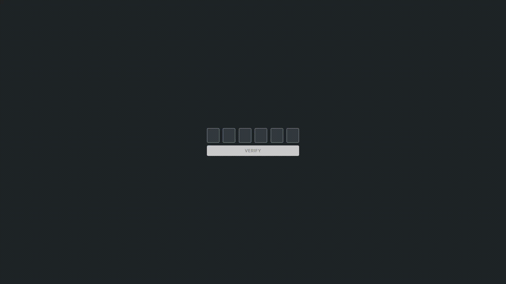

# Vanilla OTP Input

<p align="center">
  
</p>

This project is a simple **OTP (One-Time Password) Input Verification** system built with HTML, CSS, and JavaScript. It allows users to input a six-digit OTP, with automatic focus shifting between input fields and a verification button that enables only when all fields are filled.

## Features
- **Auto-focus**: Each input box automatically moves to the next one when a digit is entered.
- **Back-navigation**: If a user tries to focus on an input without filling the previous ones, the focus moves back.
- **Auto-fill**: Users can paste a six-digit OTP, and it will be distributed across the input fields.
- **Enable Verification Button**: The button is enabled only when all OTP fields are filled.
- **Loading State**: When clicking the "Verify" button, a spinner appears, and the button gets disabled.

## Project Structure
```
.
├── index.html    # Main HTML file containing the OTP input fields and Verify button
├── index.js      # JavaScript logic for input handling and button state management
├── styles.css    # Styling for the OTP fields, button, and animations
```

## How It Works
1. The **index.html** file defines six input fields inside a div container.
2. The **index.js** file listens for input events and:
   - Moves focus to the next or previous input.
   - Enables the verification button when all inputs are filled.
   - Adds a loading state to the button when clicked.
3. The **styles.css** file applies:
   - A dark theme design.
   - Focus effects on inputs.
   - Button styling with hover effects.
   - A spinner animation for the verification process.

## Usage
1. Open `index.html` in a browser.
2. Enter a six-digit OTP (or paste it).
3. Click **Verify** once all inputs are filled.
4. The button will show "Verifying..." with a loading animation.
